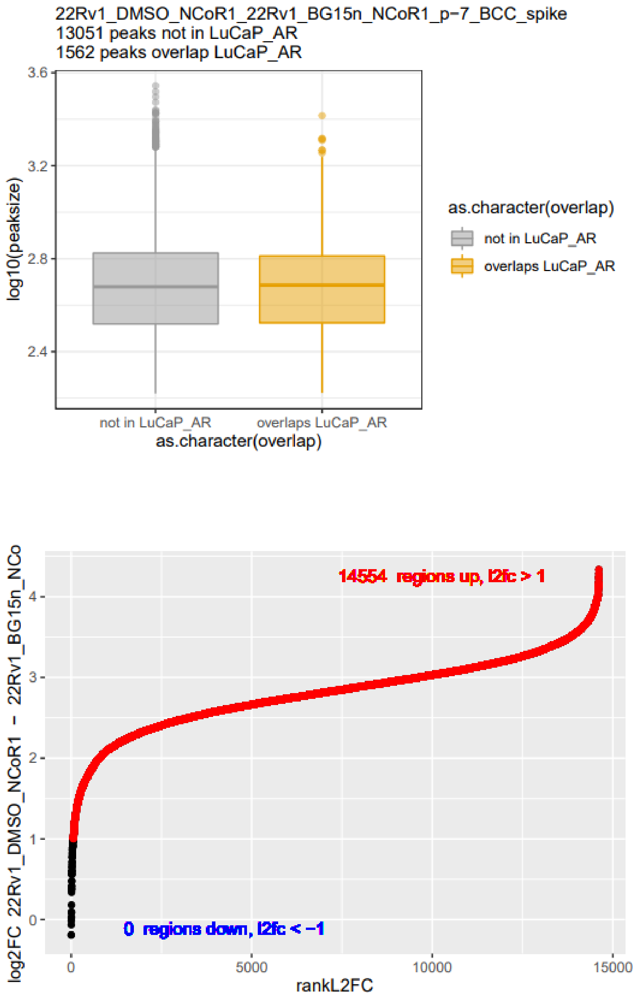

# Protocol for running BedCovComp
by Berkley E. Gryder and Shanqing Gu 
December 2021

### (1)	Generate high quality ChIP-seq or CUT&RUN data +/- a treatment condition
    [use on a DATA directory with the DATA/SampleName/SampleName.bam file structure as here https://github.com/CBIIT/ChIP_seq.]
    assumes MACS output present in the SampleName/ directory with this format:
        bed1path=${DATA_HOME}/${sample1}/MACS_${pValue}/${sample1}.clean.bed
### (2)	Configure bedCovComp
    a.  Use codebuilder, go to the “bedCov_Spiked” tab.  
        Gryder Lab location: \\ads.case.edu\rc\SOM_GENE_BEG33\ChIP_seq\hg38\scripts\multisample_analysis\bedCovComp_builder.xlsx
        Github copy: 
    b.  Add your sample names, sample file names, MACS p value (ie, p-14)
    c.  Select a bed file to split the data by an overlapping feature (ie, TSS)
    
### (3)	Run on the HPC
    a. log into HPC 
    b. in the codebuilder, copy line 23 "paste to command line:"
 
 
## Example output

